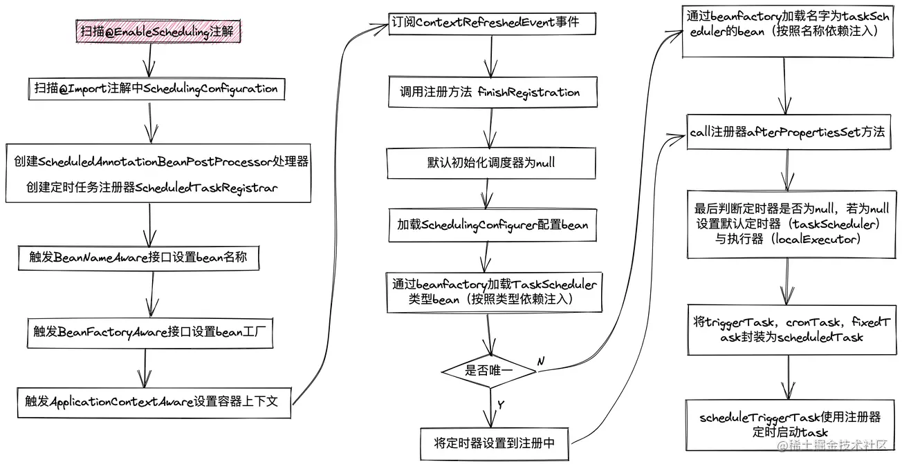

## 开启流程

```text
@EnableScheduling -> SchedulingConfiguration -> ScheduledAnnotationBeanPostProcessor -> processScheduled -> scheduledTasks
-> ContextRefreshedEvent -> finishRegistration -> ScheduledTaskRegistrar.afterPropertiesSet -> scheduleTasks -> addScheduledTask
-> ThreadPoolTaskScheduler.schedule ->  ScheduledThreadPoolExecutor (ScheduledExecutorService)
```




@Import注解是在springboot启动时将对应类以beanDefinition对象存储到spring的BeanFactory中